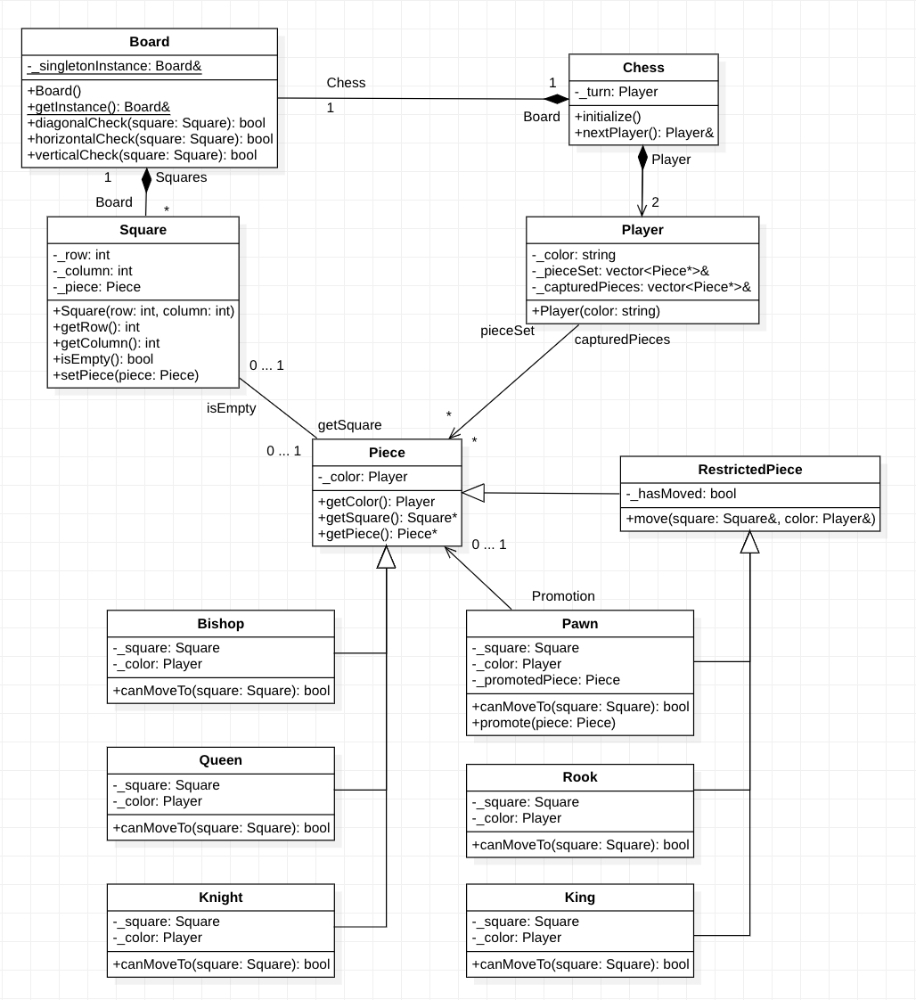

# Chess
 A complete c++ implementation of chess minus the check-mate function

---
#### Overview
In our csis 370 - Object Oriented Analysis and Design - course we were to demonstrate our understanding of the oop design pattern by creating a functional chess implementation in c++, the chosen language for the class.

##### Unified Modeling Language (UML)
Prior to actually starting to code we were tasked with creating a uml describing what we thought was an appropriate design, my attempt is shown below

#### Implementation
Afterwards we were given the assignment's uml diagram and were sent off to code away.  As this course was taken in the spring of 2020 when covid-19 first hit, we went fully online by this point, and this was also the first time we were using c++ resulting in a difficult time as prior to c++ I had no experience with such a low level language that contained pointers and references.

Overall the project itself was enjoyable but there were still some very long nights haha...

###### Details
Board
>For my implementation I had a static board class where the board itself could be reused for another game such as checkers, and therefore was to have as little dependency on the rest of the program

piece
> For the pieces there was a seperation between them as some needed to know if the piece had move yet while the other half didn't.  Therefore the normal pieces simply extended from the Piece class while the pawn, rook, and king extended from the RestrictedPiece class where I could keep track of them there.
>
> As an aside, the pawn also had a special case where it would keep track of whether it was actually a pawn, or another piece, if it had reached the opposite side of the board via the _promotedPiece variable.  Do note that in this implementation it was assumed that when a pawn would reach the other side it would become a queen.

player
> The Player class would keep track of their color, pieces, and captured pieces.  

chess
> The chess class itself is a simple class that is just used to initialize the board and players/pieces as well as start the game by inifinitely looping between each colored player.  (Due to checkmate not being implemented, there was no need to have to stop the game).

---
#### Final Thoughts
Overall through this final project I learned more about object oriented design, not just in theory but by actually practicing, and while it was difficult at times due to being unfamiliar with the language and an 'act of God,' I learned a lot from this and am thankful that I was able to participate!